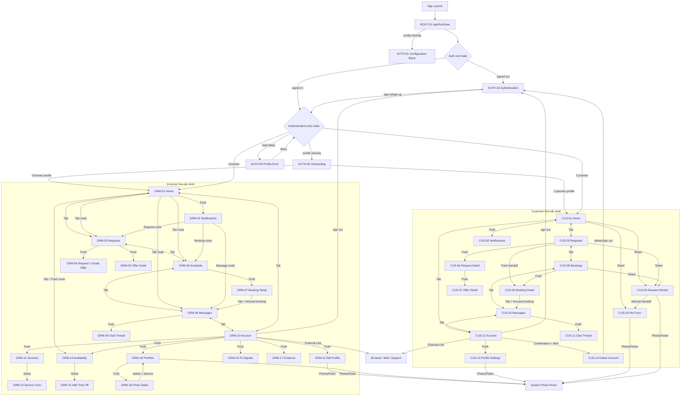

# 页面导航与用户流程

## 盘点口径

本文以 `00-inventory-scope.md` 和 `01-screen-inventory.md` 的 38 个正式页面/surface 为闭集，继续核对生产调用链。呈现方式只使用：`Tab`、`Push`、`Sheet`、`Full Screen Cover`、`Popover`、`Alert`、`Confirmation Dialog`、`Root Replacement`、`Conditional Rendering`、`External Link`、`System UI`。

静态搜索结论：未发现 `NavigationPath`、path-based navigation、`NavigationSplitView`、`fullScreenCover`、`popover` 或全局自定义 Router/Coordinator。项目使用 role tab shell 内的局部 route/focused state 完成程序化跳转。

## A. 顶层导航结构

### 启动与根页面决策

1. `BeckonApp.body` 在 `WindowGroup` 中固定创建 `AppRootView(route: .authentication, ...)`。
2. `AppComposition` 若无法加载 Supabase 配置，则 repositories/Auth store 为 `nil`，`AppRootView` 条件显示 `AuthenticationBootstrapView`（AUTH-01）。
3. 依赖完整时进入 `AuthenticationGateView`：
   - `AuthenticationStore.rootState == .loading`：条件显示 session restore loading surface；
   - `.signedOut`：显示 `AuthenticationView`（AUTH-02）；
   - `.signedIn(session)`：显示 `AuthenticatedEntryView`。
4. `AuthenticatedEntryStore.state` 再决定：
   - `.loading`：profile loading surface；
   - `.onboarding`：`RoleOnboardingView`（AUTH-03）；
   - `.customer(profile)`：`CustomerTabView`；
   - `.groomer(profile)`：`GroomerTabView`；
   - `.failure(message)`：profile load failure/retry surface（AUTH-04）。
5. Customer/Groomer 角色不是用户在主界面切换的 UI 状态，而是 profile repository 返回的权威 `MarketplaceProfile.role`。
6. Sign out 或成功删除账户使 `AuthenticationStore.rootState` 回到 signed-out，根内容被 Authentication 替换；不是 navigation pop。

### Role shells

- Customer：Home、Requests、Bookings、Messages、Account 五个 `Tab`；每个 tab 自有 `NavigationStack`。
- Groomer：Home、Requests、Schedule、Messages、Account 五个 `Tab`；每个 tab 自有 `NavigationStack`。
- 切 tab 不共享 navigation path；代码中未显式保存/清空各 stack path。
- Customer programmatic routes：`selection`、`focusedRequestID`、`focusedConversationBookingID`。
- Groomer programmatic routes：`selection`、`requestsRoute`、`focusedConversationBookingID`、`requestedProfileRoute`/`activeRoute`。

### 外部入口

- `BeckonApp.onOpenURL` 只把 URL 传给 `AuthenticationStore.handleAuthCallback(_:)`，用于 Auth callback。
- 未发现外部 URL 直接打开 request、booking、message 或 profile 页面。
- Privacy Policy、Terms/Support 等 `AppReleaseLinks` 使用外部链接，离开 App 内导航体系。

## B. 页面关系表

### 根状态、认证与角色

| 来源页面 | 触发入口 | 目标页面或界面 | 呈现方式 | 触发条件 | 完成后行为 | 证据 |
|---|---|---|---|---|---|---|
| App launch | `WindowGroup` | ROOT-01 AppRoot | Root Replacement | 每次启动 | 继续由配置/Auth 状态决定内容 | `BeckonApp.body` |
| ROOT-01 | 缺少 production dependencies | AUTH-01 配置阻塞 | Conditional Rendering | `AppComposition` 配置失败 | 无页面内恢复导航；修复配置/重启待确认 | `AppRootView.body` |
| ROOT-01/Auth Gate | session restoring | loading surface | Conditional Rendering | `.loading` | restore 完成后替换为 signed-out/signed-in | `AuthenticationGateView.body` |
| Auth Gate | signed out | AUTH-02 登录/注册 | Root Replacement | `.signedOut` | 成功后 root state 替换为 signed-in | `AuthenticationGateView.body` |
| AUTH-02 | Get Started / 已有账户 | auth form/landing | Conditional Rendering | local `AuthenticationSurface` | Back 只回 landing；submit 成功进入 signed-in | `AuthenticationView.surface/openForm` |
| App | auth callback URL | AUTH-02/Auth state | Root Replacement | callback 被 Auth store 接受 | 更新 session 后进入 authenticated entry | `BeckonApp.onOpenURL`、`handleAuthCallback` |
| Auth Gate | signed in | Authenticated Entry | Root Replacement | `.signedIn(session)` | profile lookup 决定 onboarding/role/error | `AuthenticationGateView.body` |
| Authenticated Entry | profile loading | profile loading surface | Conditional Rendering | `.loading` | 读取完成后替换 | `AuthenticatedEntryView.body` |
| Authenticated Entry | profile missing | AUTH-03 Onboarding | Conditional Rendering | `.onboarding` | create profile 成功进入 role tabs | `AuthenticatedEntryView.body` |
| AUTH-03 | Sign Out | AUTH-02 | Root Replacement | 用户退出 | protected UI 被替换 | `RoleOnboardingView.onSignOut` |
| Authenticated Entry | profile load failed | AUTH-04 failure | Conditional Rendering | `.failure(message)` | Retry 重读；Sign Out 回 AUTH-02 | `loadFailureView(message:)` |
| Authenticated Entry | Customer profile | Customer five-tab shell | Root Replacement | `.customer(profile)` | 保持至 sign out/session loss | `AuthenticatedEntryView.body` |
| Authenticated Entry | Groomer profile | Groomer five-tab shell | Root Replacement | `.groomer(profile)` | 保持至 sign out/session loss | `AuthenticatedEntryView.body` |
| Customer/Groomer Account | Sign Out | AUTH-02 | Root Replacement | `AuthenticationStore.signOut()` 成功 | tabs 消失 | account sign-out callbacks |

### Customer 页面关系

| 来源页面 | 触发入口 | 目标页面或界面 | 呈现方式 | 触发条件 | 完成后行为 | 证据 |
|---|---|---|---|---|---|---|
| Customer shell | tab item | CUS-01 Home | Tab | Customer role；默认 `.home` | 保留 role shell | `CustomerTabView.selection/destination` |
| Customer shell | tab item | CUS-05 Requests | Tab | Customer role | 保留 role shell | 同上 |
| Customer shell | tab item | CUS-08 Bookings | Tab | Customer role | 保留 role shell | 同上 |
| Customer shell | tab item | CUS-10 Messages | Tab | Customer role | 保留 role shell | 同上 |
| Customer shell | tab item | CUS-12 Account | Tab | Customer role | 保留 role shell | 同上 |
| CUS-01 | notification bell | CUS-02 Notifications | Push | Customer Home 可用 | Back 返回 Home | `isShowingNotifications` + `navigationDestination` |
| CUS-01 | Add/Edit pet | CUS-03 Pet Form | Sheet | `petStore.isShowingPetForm` | cancel/save 将 flag 置 false，Sheet 关闭；失败保持 | `CustomerPetsView.sheet`、Pet store form methods |
| CUS-04 | Add Pet handoff | CUS-03 Pet Form | Sheet | wizard 无合适 pet，触发 closure | 先取消 wizard，延迟 `petStore.startCreate()` | `CustomerPetsView` wizard closure |
| CUS-01 | Start request | CUS-04 Request Wizard | Sheet | pet/request eligibility 允许 | cancel 关闭；publish 成功关闭并刷新；失败保持 draft | `startGroomingRequest`、`isShowingWizard` |
| CUS-01 | active request card | CUS-05 Requests | Tab | 有 request ID | 设置 `focusedRequestID` 后切 Requests | `onActiveRequestSelected` |
| CUS-05 | focused request | CUS-06 Request Detail | Push | Store 可找到该 request | 清除/消费 focused ID；Back 返回 Requests | `focusedRequestID` 与 dashboard links |
| CUS-05 | request row/card | CUS-06 Request Detail | Push | request 可见 | Back 返回 Requests | `CustomerRequestsDashboardView.NavigationLink` |
| CUS-06 | offer row | CUS-07 Offer Detail | Push | request 有 offer | Back 返回 Request Detail；accept 成功刷新权威状态 | `CustomerOfferReviewSection.NavigationLink` |
| CUS-05 | New Request / Republish | CUS-04 Wizard | Sheet | store 建立 draft | publish/cancel 关闭；失败保持 | `wizardPresentationBinding` |
| CUS-05 | Cancel request | cancel request confirmation | Alert | selected request 可取消 | Cancel 关闭；确认后 mutation/refresh，停留 Requests | `.alert("Cancel this request?")` |
| CUS-05 | booking handoff | CUS-09 Booking Detail | Push | `selectedBookingHandoff` 非 nil | Back 返回 Requests | `.navigationDestination(item:)` |
| CUS-08 | booking row | CUS-09 Booking Detail | Push | booking 可见 | Back 返回 Bookings | `BookingsView.NavigationLink` |
| CUS-08 | republish cancelled booking | CUS-04 Wizard | Sheet | Customer + request dependencies + eligible booking | publish/cancel 关闭 | `BookingsView.sheet` |
| CUS-09 | Open Chat | CUS-10 Messages | Tab | booking 有 conversation route | 设置 booking ID，切 Messages | `CustomerTabView.openBookingChat` |
| CUS-10 | focused booking | CUS-11 Chat Thread | Push | conversation list含对应 booking | 设置 `focusedConversation`，清空 focused ID | `openFocusedConversationIfPossible()` |
| CUS-10 | conversation row | CUS-11 Chat Thread | Push | participant conversation | Back 返回 Messages | `conversationLink(_:)` |
| CUS-12 | Profile Settings | CUS-13 Profile Settings | Push | Customer profile store available | Back 返回 Account；Save 后停留并反馈 | `CustomerAccountMenuLink`、`saveProfile()` |
| CUS-12 | Privacy/Support links | browser/mail/system destination | External Link | release URL 可用 | 返回行为由系统控制 | `AccountReleaseLinksSection` |
| CUS-12 | Delete Account | first warning | Confirmation Dialog | tap destructive control | Continue 打开 final alert；Cancel 关闭 | `AccountDangerActions.confirmationDialog` |
| first warning | Continue | final delete warning | Alert | 用户继续 | Delete 调 account deletion；Cancel 返回 Account | `AccountDangerActions.alert` |
| final delete warning | Delete Account | AUTH-02 | Root Replacement | backend/local cleanup 成功 | session 清除并退出 protected UI | `AuthenticationStore.deleteAccount()` |
| CUS-03/CUS-04/CUS-13 | PhotosPicker | iOS photo picker | System UI | 用户选择上传图片 | 选择/取消后回原页面；上传结果由 Store 反馈 | `PhotosPicker` calls |

### Groomer 页面关系

| 来源页面 | 触发入口 | 目标页面或界面 | 呈现方式 | 触发条件 | 完成后行为 | 证据 |
|---|---|---|---|---|---|---|
| Groomer shell | tab item | GRM-01 Home | Tab | Groomer role；默认 `.home` | 保留 role shell | `GroomerTabView.selection/destination` |
| Groomer shell | tab item | GRM-03 Requests | Tab | Groomer role | segment route 保存在 `requestsRoute` | 同上 |
| Groomer shell | tab item | GRM-06 Schedule | Tab | Groomer role | 保留 role shell | 同上 |
| Groomer shell | tab item | GRM-08 Messages | Tab | Groomer role | 保留 role shell | 同上 |
| Groomer shell | tab item | GRM-10 Account | Tab | Groomer role | 保留 role shell | 同上 |
| GRM-01 | notification bell | GRM-02 Notifications | Push | notification store available | Back 返回 Home；row route 可切其他 tab | `GroomerHomeHeader.NavigationLink` |
| GRM-01 | Requests/Offers attention | GRM-03 Requests | Tab | tap shortcut | 写 `.matches/.offers` 后切 Requests | `openRequests(_:)` |
| GRM-01 | next booking | GRM-06 Schedule | Tab | tap booking action | 只切 Schedule，未设置 focused booking | `bookingAction: { _ in select(.bookings) }` |
| GRM-01 | Messages | GRM-08 Messages | Tab | tap shortcut | 切 Messages，无指定 thread | `messagesAction` |
| GRM-01 | Availability | GRM-10 Account → GRM-14 Availability | Tab | profile 加载成功 | 先写 requested route、切 Account，再程序化 Push destination | `openAvailability()`、`activatedRoute` |
| GRM-02 | request notification | GRM-03/GRM-04 | Tab | `.requests(requestID)` | 切 Requests/Matches；ID 存在则随后程序化 Push detail | `openNotificationRoute`、`GroomerRequestsRoute` |
| GRM-02 | offer notification | GRM-03/GRM-05 | Tab | `.offers(offerID)` | 切 Requests/Offers；ID 存在则随后程序化 Push detail | 同上 |
| GRM-02 | booking notification | GRM-06 Schedule | Tab | `.bookings` | 仅切 tab；booking ID 未传给 detail | `openNotificationRoute` |
| GRM-02 | message notification | GRM-08/GRM-09 | Tab | `.messages(bookingID)` | 写 focused booking、切 Messages；找到 conversation 后随后程序化 Push | 同上 + Chat focused route |
| GRM-03 | segment control | Matches/Offers content | Conditional Rendering | `route.segment` | 保持 Requests tab | `GroomerRequestsView` segment binding |
| GRM-03 | match row/focused ID | GRM-04 Request/Create Offer | Push | match 存在 | Back 返回 Matches；mutation 后刷新，未见自动 pop | `.navigationDestination($focusedMatchID)` |
| GRM-03 | offer row/focused ID | GRM-05 Offer Detail | Push | offer 存在 | Back 返回 Offers；withdraw 后刷新，未见自动 pop | `.navigationDestination($focusedOfferID)` |
| GRM-04 | Dismiss match | updated Requests state | Conditional Rendering | match 可 dismiss | mutation/refresh；页面是否自动 pop 未发现明确调用 | `GroomerRequestsStore.dismiss` 调用链 |
| GRM-04 | Submit Offer | updated Requests/Offers state | Conditional Rendering | form valid + backend success | refresh；未发现 `dismiss()`，可能停留 detail | offer submit handler |
| GRM-05 | Withdraw Offer | updated Offer Detail | Conditional Rendering | offer 可撤回 | refresh；未发现自动 pop | `GroomerOffersStore.withdraw` |
| GRM-06 | appointment row | GRM-07 Booking Detail | Push | booking visible | Back 返回 Schedule | `GroomerScheduleAppointmentRow.NavigationLink` |
| GRM-07 | Open Chat | GRM-08/GRM-09 | Tab | booking conversation exists | 写 booking ID、切 Messages、随后程序化 Push thread | `GroomerTabView.openBookingChat` |
| GRM-08 | conversation row/focused booking | GRM-09 Chat Thread | Push | conversation exists | Back 返回 Messages | `ChatConversationsView` |
| GRM-10 | Edit Profile | GRM-11 | Push | profile loaded | native Back；Save 后停留并反馈 | `GroomerAccountMenuLink`、`saveProfile()` |
| GRM-10 | Services | GRM-12 | Push | profile loaded | Back 返回 Account | Account menu link |
| GRM-12 | Add/Edit Service | GRM-13 Service Form | Sheet | shared store sets `isShowingServiceForm` | cancel 置 false；save 成功置 false；失败保持 | Management `.sheet`、Store methods |
| GRM-12 | Delete Service | updated Services list | Conditional Rendering | service exists | mutation 成功更新列表，停留 Services | `deleteService(_:)` |
| GRM-10 | Availability | GRM-14 | Push | profile loaded | Back 返回 Account；Save 后停留 | Account link / route destination |
| GRM-14 | Add Time Off | GRM-15 | Sheet | `isShowingTimeOffForm` | Cancel dismiss；save 成功 flag false + dismiss；失败保持 | Availability `.sheet`、form methods |
| GRM-14 | Delete Time Off | updated Availability | Conditional Rendering | time-off row exists | mutation 更新列表，停留 | `deleteTimeOff(_:)` |
| GRM-10 | Fit Signals | GRM-16 | Push | profile loaded | Back 返回 Account；save 后停留 | Account link、`saveFitClaims()` |
| GRM-10 | Evidence | GRM-17 | Push | profile loaded | Back 返回 Account | Account link |
| GRM-10 | Portfolio | GRM-18 | Push | profile loaded | Back 返回 Account | Account link |
| GRM-18 | Add photo | iOS photo picker | System UI | PhotosPicker | 成功上传后停留 gallery；取消回 gallery | Portfolio PhotosPicker |
| GRM-18 | photo tile | GRM-19 Photo Detail | Push | photo exists | Back 返回 gallery | gallery `NavigationLink` |
| GRM-19 | Save fit notes | updated Photo Detail | Conditional Rendering | valid photo | 保存后停留 detail | `saveFitNotes()` |
| GRM-19 | Delete photo | delete warning | Confirmation Dialog | tap Delete | Cancel 关闭；确认调用 delete | detail `confirmationDialog` |
| delete warning | Delete Photo | GRM-18 Portfolio | Push | Store 确认照片已移除 | `dismiss()` 结束当前 Push，返回 gallery | `deletePhoto()` |
| Groomer Account | Privacy/Support | browser/mail/system destination | External Link | URL 可用 | 系统控制返回 | `GroomerAccountExternalLink` |

### 未发现的呈现方式

| 来源页面 | 触发入口 | 目标页面或界面 | 呈现方式 | 触发条件 | 完成后行为 | 证据 |
|---|---|---|---|---|---|---|
| 全项目正式 Feature | 未发现 | 未发现 | Full Screen Cover | 未发现实现 | 不适用 | `rg '.fullScreenCover('` 无结果 |
| 全项目正式 Feature | 未发现 | 未发现 | Popover | 未发现实现 | 不适用 | `rg '.popover('` 无结果 |

## C. 核心用户流程

### 流程名称：启动 App 并恢复会话

起点：用户启动 App。
前置条件：App bundle 可读取配置。

步骤：
1. `BeckonApp` 创建 composition 与 ROOT-01。
2. Auth Gate 显示 restoring-session 条件状态。
3. 无 session 时 root replacement 到 AUTH-02；有 session 时进入 profile lookup。
4. profile role 为 Customer/Groomer 时替换为对应五-tab shell。

终点：AUTH-02、Customer Home 或 Groomer Home。
失败或中断路径：配置失败到 AUTH-01；profile load 失败到 AUTH-04，可 Retry/Sign Out。
涉及页面：ROOT-01、AUTH-01、AUTH-02、AUTH-04、CUS-01、GRM-01。
代码证据：`BeckonApp.body`、`AppRootView.body`、`AuthenticationGateView.body`、`AuthenticatedEntryView.body`。

### 流程名称：注册并完成角色 Onboarding

起点：AUTH-02 landing。
前置条件：signed out。

步骤：
1. 点 Get Started，条件呈现 sign-up form。
2. 输入 email/password/confirmation，调用 `AuthenticationStore.submit()`。
3. Auth 成功后进入 authenticated profile lookup。
4. profile 缺失时显示 AUTH-03。
5. 选择角色、填写 display name 并创建 profile。
6. 权威 profile role 决定进入 Customer 或 Groomer shell。

终点：CUS-01 或 GRM-01。
失败或中断路径：表单错误停留 AUTH-02；profile 创建失败停留 AUTH-03；可 sign out。
涉及页面：AUTH-02、AUTH-03、CUS-01、GRM-01。
代码证据：`AuthenticationView`、`AuthenticationStore.submit()`、`AuthenticatedEntryStore.createProfile`、`AuthenticatedEntryView.body`。

### 流程名称：Customer 创建宠物

起点：CUS-01。
前置条件：Customer 已登录。

步骤：
1. 点 Add Pet，`CustomerPetsStore.startCreate()` 使 form flag 为 true。
2. CUS-03 以 Sheet 显示。
3. 输入 pet 字段，可调用 PhotosPicker。
4. Save 通过 Store repository mutation。
5. 成功后 form flag 变 false，Sheet 关闭并显示刷新后的 pet。

终点：CUS-01。
失败或中断路径：验证/上传/repository 失败保持 Sheet；Cancel 重置 draft 并关闭。
涉及页面：CUS-01、CUS-03、System UI。
代码证据：`CustomerPetsView.sheet`、`CustomerPetFormView`、`CustomerPetsStore` form methods。

### 流程名称：Customer 发布 Grooming Request

起点：CUS-01、CUS-05 或 CUS-08。
前置条件：Customer、至少一个可选 pet；republish 需 eligible cancelled request/booking。

步骤：
1. 触发 Start/New/Republish，Store 建立 wizard draft。
2. CUS-04 以 Sheet 显示。
3. 依次选择 pet、service、time、location、photos/fit inputs 并 review。
4. Publish 调 repository/RPC。
5. 成功后关闭 Sheet并刷新 requests；用户可在 CUS-05 查看。

终点：CUS-05 中的最新 request 状态，或原 tab 的刷新状态。
失败或中断路径：无 pet 可切 CUS-03；Cancel 丢弃 sheet draft；失败保留可恢复输入。
涉及页面：CUS-01、CUS-03、CUS-04、CUS-05、CUS-08。
代码证据：三个 wizard `.sheet`、`CustomerRequestsStore` wizard/publish methods。

### 流程名称：Customer 查看并接受 Offer

起点：CUS-05。
前置条件：request 可见且存在 offer。

步骤：
1. Push CUS-06 Request Detail。
2. 点 offer row，Push CUS-07。
3. 查看 groomer、price、time、fit evidence/message。
4. 点 Accept，Store 调 acceptance repository/RPC。
5. 成功后刷新 request/offer/booking 权威状态。

终点：accepted 状态的 Offer/Request Detail；booking 可从 Requests/Bookings 进入 CUS-09。
失败或中断路径：冲突/权限/网络错误停留 detail 并反馈；Back 可逐层退出。
涉及页面：CUS-05、CUS-06、CUS-07、CUS-09。
代码证据：Request dashboard links、`CustomerOfferDetailView`、`CustomerRequestsStore.acceptOffer` 调用链。

### 流程名称：Customer 取消 Request

起点：CUS-05。
前置条件：request 状态允许取消。

步骤：
1. 点 Cancel Request。
2. 显示 Alert。
3. 用户确认后 Store 执行 cancel mutation。
4. 刷新列表/状态并停留 Requests。

终点：CUS-05 的 cancelled 状态。
失败或中断路径：取消 Alert 不执行；mutation 失败保留原状态并反馈。
涉及页面：CUS-05、Alert。
代码证据：`CustomerRequestsView.isCancelAlertPresented`、`.alert`、cancel handler。

### 流程名称：Booking 查看、聊天、完成与 Review

起点：CUS-08 或 GRM-06。
前置条件：用户是 booking participant。

步骤：
1. 点 booking row，Push 对应角色的 Booking Detail。
2. 可执行角色允许的 Cancel；Groomer 可 Complete，Customer completed booking 可 Submit Review。
3. 点 Open Chat 时 shell 写入 booking ID 并切 Messages tab。
4. Chat list 找到 conversation 后程序化 Push thread。

终点：更新后的 Booking Detail 或对应 Chat Thread。
失败或中断路径：mutation 失败停留 detail；找不到 conversation 时清空 focused ID 并报告错误，不虚构 thread。
涉及页面：CUS-08/09/10/11、GRM-06/07/08/09。
代码证据：`BookingsView`、`BookingDetailView`、role action presentation、`openBookingChat`、`openFocusedConversationIfPossible()`。

### 流程名称：Customer 编辑 Profile

起点：CUS-12。
前置条件：Customer profile loaded。

步骤：
1. Push CUS-13。
2. 编辑 contact/address，必要时打开 PhotosPicker。
3. 点 Save Profile 调 `CustomerProfileStore.saveProfile()`。
4. 成功后停留设置页并显示反馈；用户用 Back 返回 Account。

终点：CUS-13 或返回 CUS-12。
失败或中断路径：失败停留并显示 global feedback；Back 是否丢弃未保存字段没有专用确认。
涉及页面：CUS-12、CUS-13、System UI。
代码证据：Account menu link、settings Save bar、Customer Profile Store。

### 流程名称：Customer 删除账户或退出

起点：CUS-12。
前置条件：authenticated Customer。

步骤：
1. Sign Out 直接调用 Auth store；或选择 Delete Account。
2. 删除路径先显示 Confirmation Dialog，再显示 final Alert。
3. 最终确认调用 `deleteAccount()`。
4. 成功清除 session/local protected state，Root Replacement 到 AUTH-02。

终点：AUTH-02。
失败或中断路径：任一 Cancel 返回 Account；删除失败停留 Account 并显示错误。
涉及页面：CUS-12、CUS-14、AUTH-02。
代码证据：`CustomerAccountView`、`AccountDangerActions`、`AuthenticationStore`。

### 流程名称：Groomer 查看 Match 并创建 Offer

起点：GRM-01 或 GRM-03。
前置条件：Groomer profile 且存在 matched request。

步骤：
1. Home shortcut 或 Requests tab 进入 Matches segment。
2. 点 match row，Push GRM-04。
3. 查看 request/pet/fit evidence。
4. 填写 proposed time、price、message，Submit Offer。
5. Store 调 repository，刷新 Matches/Offers。

终点：更新后的 GRM-04 或 GRM-03；代码未证明自动 pop。
失败或中断路径：可 Dismiss match；验证/repository 失败停留 detail。
涉及页面：GRM-01、GRM-03、GRM-04。
代码证据：`openRequests`、`GroomerRequestsView` destinations、offer submit handlers。

### 流程名称：Groomer 管理 Services

起点：GRM-10。
前置条件：profile loaded。

步骤：
1. Push GRM-12。
2. Add/Edit 将共享 Store form flag 置 true，GRM-13 以 Sheet 显示。
3. 编辑 service details/sizes，Save。
4. 成功时 Store 关闭 flag、重置 form，Sheet 关闭并刷新 Services。
5. Delete Service 成功后停留 Services 列表。

终点：GRM-12。
失败或中断路径：Save/Delete 失败停留当前页面；Cancel 关闭 Sheet并重置 draft。
涉及页面：GRM-10、GRM-12、GRM-13。
代码证据：Account menu、Management `.sheet`、`saveService/cancelServiceForm/deleteService`。

### 流程名称：Groomer 管理 Availability 与 Time Off

起点：GRM-01 或 GRM-10。
前置条件：profile loaded。

步骤：
1. Account link直接 Push，或 Home 写 `.availability` 并切 Account 后程序化 Push GRM-14。
2. 编辑 weekly hours/preferences，Save 后停留。
3. Add Time Off 打开 GRM-15 Sheet。
4. Save 成功关闭 Sheet；Delete time off 更新列表并停留。

终点：GRM-14 或 Back 到 GRM-10。
失败或中断路径：profile 未加载时 requested route 暂不激活；保存失败停留；Cancel Time Off 关闭 Sheet。
涉及页面：GRM-01、GRM-10、GRM-14、GRM-15。
代码证据：`openAvailability()`、`GroomerProfileRoute.activatedRoute`、availability Store methods。

### 流程名称：Groomer 编辑 Profile/Fit Signals 并查看 Evidence

起点：GRM-10。
前置条件：profile loaded。

步骤：
1. 选择 Edit Profile、Fit Signals 或 Evidence，分别 Push GRM-11/16/17。
2. Profile/Fit 页面编辑后 Save，成功停留当前页面并反馈。
3. Evidence 当前按代码确认是 overview/empty surface，Back 返回 Account。

终点：当前设置页或 GRM-10。
失败或中断路径：保存失败停留；未发现未保存离开确认。
涉及页面：GRM-10、GRM-11、GRM-16、GRM-17。
代码证据：Groomer Account menu destinations、profile/fit save methods、Evidence body。

### 流程名称：Groomer 管理 Portfolio

起点：GRM-10。
前置条件：profile loaded。

步骤：
1. Push GRM-18。
2. PhotosPicker 选择图片并上传，成功后停留 gallery。
3. 点 photo tile Push GRM-19。
4. 编辑 fit notes/tags并保存，停留 detail。
5. Delete 显示 Confirmation Dialog；成功删除后 `dismiss()` 回 GRM-18。

终点：GRM-18 或 GRM-19。
失败或中断路径：picker cancel 回 gallery；upload/save/delete 失败停留并反馈；delete dialog Cancel 停留 detail。
涉及页面：GRM-10、GRM-18、GRM-19、System UI。
代码证据：Portfolio Account link、PhotosPicker、photo NavigationLink、`saveFitNotes/deletePhoto`。

### 流程名称：从 Groomer Notification 程序化导航

起点：GRM-02。
前置条件：通知包含可解析的 `GroomerNotificationRoute`。

步骤：
1. 点击通知并交给 `notificationRouteAction`。
2. Requests/Offers：构造 `GroomerRequestsRoute`，切 Requests；ID 存在时 Push对应 detail。
3. Bookings：只切 Schedule。
4. Messages：写 booking ID，切 Messages；Chat store 加载后找到 conversation 并 Push thread。

终点：GRM-03/04/05/06/08/09 之一。
失败或中断路径：route 无 ID 时停留 tab root；conversation 不存在时清空 focused ID并反馈。
涉及页面：GRM-02 至 GRM-09。
代码证据：`GroomerNotificationRoute`、`openNotificationRoute(_:)`、`GroomerRequestsRoute.init(notificationRoute:)`、Chat focused logic。

## D. Mermaid 导航图

## E. 导航不确定项

### 页面存在但没有发现普通 production 入口

- `AppRootView(route: .roleOnboarding/.customer/.groomer)` 的直接 route 分支只确认 Preview；正式 App 固定 `.authentication`，角色页面通过 Authenticated Entry 条件显示。
- `AuthenticatedAccountView` 作为 Groomer `accountContent` fallback 被注入，但正式 `GroomerAccountHomeView` 同时收到 `onSignOut` 时优先显示直接 Sign Out，不显示该 fallback NavigationLink。因此 Groomer 普通 production 删除账户入口未确认。
- `DebugPanelView` 只在 `#if DEBUG` account links/Preview 中有入口，排除普通 production。

### 入口存在但目标或完成行为不完全明确

- Groomer Home/notification 的 booking route 只切 Schedule，虽 route model 可带 booking ID，但 `openNotificationRoute` 没有把 ID传给 `BookingDetailView`。
- Groomer request dismiss、offer submit/withdraw 后未发现明确 `dismiss()`；确认会刷新 Store，但是否因数据移除导致系统自动返回需运行验证。
- Customer notification row 是否进行业务页面跳转：当前只确认列表/mark-read，未确认对应 Customer route coordinator。
- Profile/Availability/Fit 保存成功后没有 pop/dismiss；代码显示停留并反馈。未保存时 Back 没有 confirmation，是否接受丢弃是产品层待确认。

### 路由枚举或值的使用情况

- `AppEntryRoute.productionDefault` 定义为 `.authentication`；`BeckonApp` 直接传 `.authentication`，其余 cases 未发现 production caller。
- `GroomerProfileRoute` 只有 `.availability`，已由 Home → Account programmatic route 使用；不是废弃枚举。
- `GroomerRequestsRoute` 的 segment/requestID/offerID 都有 Home/notification/Requests 使用证据。
- `GroomerNotificationRoute` 四个 cases 均在 `openNotificationRoute` 处理；booking ID 当前未消费。
- 未发现 Customer notification 对应的业务 Route enum。

### 可能废弃或仅条件出现的页面

- `FeaturePlaceholderView` 只在 tab production dependencies 缺失时出现；正常 composition 下不属于业务流程。
- AUTH-01 只在配置失败时出现；AUTH-03 只在 signed-in profile 缺失时出现；AUTH-04 只在 profile lookup 失败时出现。
- Customer/Groomer 页面由权威 role 互斥呈现，App 内没有角色切换器。

### 循环或重复导航结构

- Customer/Groomer 都使用“五个 tab × 每 tab 一个 NavigationStack”的重复结构，是有意的 role shell 结构。
- Booking Detail → Messages tab → Chat Thread、Home → Account → Availability 是跨 tab 后再 push 的两段式路径；不是 `NavigationPath`。
- Customer Requests 与 Bookings 都能打开同一个 Request Wizard；Requests 与 Bookings 都能进入同一个 Booking Detail。这是共享 feature surface，不是重复页面实现。
- Chat thread同时可由 row push和 focused booking programmatic push；后者会消费/清空 focused ID，避免重复打开。是否在快速重复事件下出现二次 push需运行时验证。

## 本阶段停止点

本文完成页面导航与用户流程盘点，不继续创建页面状态矩阵、操作/数据契约、UI 重设计或 Figma 原型。
